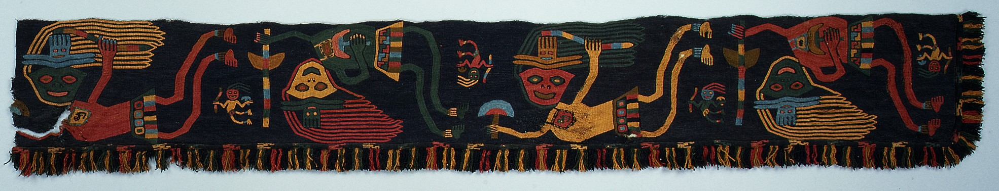

# Dotfile{init}.sh

> "Knowing only a single language and a single culture implies the danger of thinking that 'the way we do things' is the only way or the only good way. That way opportunities are missed, and sub-optimal programs are produced."
> -- <cite>Bjarne Stroustrup</cite>
